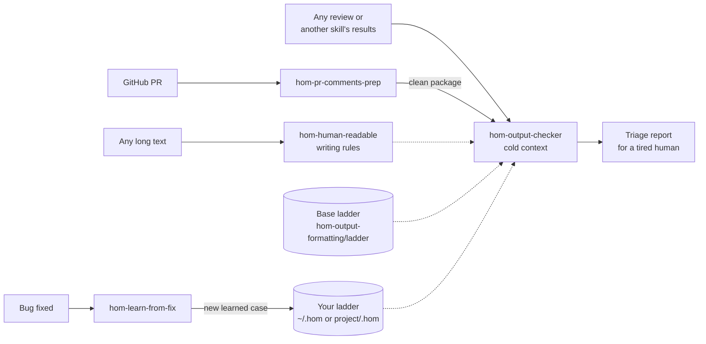

# homoantropos / skills

*Skills for Claude — and other agents — by a dabbler who believes AI should help us be more human.*

Not *Homo sapiens*, the knowing human. *Homo antropos*: the humane one.

These skills are built around one idea: **the reader is a tired human**. Exhausted, under pressure, maybe reading between air-raid alerts. So every report is shaped to make sure the dangerous things get fixed first, even on the worst day.

## The ladder

Every finding lands on one of five levels:

| | Level | Meaning |
|---|---|---|
| 🔴 | **Killed** | Must not ship. Wrong results, crashes, freezes, security holes, irreversible data loss — and, worst of all, code built on a false premise. |
| 🟠 | **Wounded** | Fix before commit. Missing guards, races, leaks, layout shift, broken documented rules. |
| 🟡 | **Kicked in the pants** | Should fix. Possible failures, invasive or unrelated changes. |
| 🔵 | **Scolded** | Worth noticing. Duplicates, dead code, sloppy git hygiene. |
| 🟢 | **Praised** | Always there. What was done right, in the same order — because praise teaches. |

Severity depends on **how certain the harm is** and **whether an explicit agreement was broken**. Silent lies rank above crashes: a crash is visible, a lie is not.

## Skills

Folders stay flat (`skills/<name>/`) so every agent finds them; this list groups them by use.

### Output formatting

Make any result readable for a tired human.

**Main** — each works on its own:

| Skill | What it does |
|---|---|
| [`hom-human-readable`](skills/hom-human-readable/SKILL.md) | Turns **any** long text — a law, contract, spec, report or thread — into a brief a tired human can act on: bottom line first, what to do and by when, key numbers, details with a source reference for every claim, and an honest list of what's unclear. The writing rules every other skill here uses. |
| [`hom-output-formatting`](skills/hom-output-formatting/SKILL.md) | Takes the **text** of a review or a code check, formats it on the ladder, and double-checks it with fresh eyes: marks its own findings with 🔍, flags doubtful fixes, and says plainly when a fix is uncertain. Never reviews code itself. Cases for each level live in [`ladder/`](skills/hom-output-formatting/ladder/), plus your own learned ones. |

**Helpers:**

| Helper | What it does |
|---|---|
| [`hom-output-checker`](agents/hom-output-checker.md) (agent) | Runs `hom-output-formatting` in a cold context with no file tools, so it can't drift into reviewing code. It can't read the ladder files either: **always pass it the output of** `skills/hom-output-formatting/scripts/load_ladder.sh` with the review — otherwise it warns that severity is by principle only. |

### Dev

For programming work.

| Skill | What it does |
|---|---|
| [`hom-pr-comments-prep`](skills/hom-pr-comments-prep/SKILL.md) | Pulls the open review comments of a GitHub PR, drops resolved and bot threads, marks outdated ones, masks possible secrets, keeps the diff each comment was written on, and hands everything to the checker. |
| [`hom-learn-from-fix`](skills/hom-learn-from-fix/SKILL.md) | After a bug fix, finds the root cause and real impact, and if the ladder doesn't know that pattern yet, teaches **your** ladder — one generalized line, no private details, stored on your machine or in your project. |
| [`hom-skill-dryer`](skills/hom-skill-dryer/SKILL.md) | Tree-shakes a finished skill: tightens the description, keeps only what every run needs, moves rare parts to `references/`, then runs the skill's evals and overwrites it only if they still pass. |

### Shared

General-purpose skills. Coming next; `hom-human-readable` above already works on any text.

## Language

Skills answer in the language you write to them in. Ask in Ukrainian — get Ukrainian; ask in English about a Ukrainian document — get English.

## Safety

- No skill outputs, quotes or stores secrets or personal identifiers (passwords, API keys, tokens, card or ID numbers). They show up as `[REDACTED: <kind>]`, and a leaked secret is reported as a 🔴 finding: revoke and rotate it.
- `hom-pr-comments-prep` masks secret-like values in a script, before PR text reaches the model.
- Skills work only in your current project and never touch this repository.

## How they fit together



## Install

### Claude Code — as a plugin (recommended)

```
/plugin marketplace add homoantropos/skills
/plugin install homoantropos@homoantropos
```

Skills and the agent arrive together, prefixed with the plugin name: `homoantropos:hom-output-checker`.

### Claude Code — without the plugin system

Copying only `skills/` is **not enough**: `hom-output-checker` is an **agent** and lives in `agents/`. Without it the checker can't run cold. Use the install script, which copies both:

```bash
git clone https://github.com/homoantropos/skills
cd skills
./install.sh                  # for all your projects: ~/.claude/skills and ~/.claude/agents
./install.sh ~/code/my-app    # or for one project:    ~/code/my-app/.claude/...
```

Run it again to update. It replaces only the `hom-*` skills and the agent, never your learned cases. Start a new session afterwards.

If the agent is missing anyway, `hom-pr-comments-prep` falls back to a fresh general-purpose subagent, then to the main session, and says in the report that the check was not cold.

### Claude.ai

Upload one ZIP per skill: **Customize → Skills → + → Upload a skill** (code execution must be on). Zip the whole skill folder, so `hom-output-formatting` keeps its `ladder/`. Use `hom-human-readable`, `hom-output-formatting` and `hom-skill-dryer` there; `hom-pr-comments-prep` and `hom-learn-from-fix` need `gh`, git and local files, so they are for Claude Code. On Claude.ai the base ladder is used as is.

### Other agents

The skills use the open SKILL.md format: plain Markdown with a short YAML header. Copy the `skills/` folders to wherever your agent reads skills, or point it at [`AGENTS.md`](AGENTS.md).

## Letting the ladder learn

The ladder ships with base cases in [`skills/hom-output-formatting/ladder/`](skills/hom-output-formatting/ladder/): one file per level. Every user or team then trains **their own** ladder: after each bug fix, `hom-learn-from-fix` may add one generalized line. Nothing is ever sent back to this repository.

**Where your lessons live.** On the first lesson the skill asks you to choose:

| Choice | Folder | Who gets it |
|---|---|---|
| Personal | `~/.hom/ladder/` | Only you, in every project on this machine |
| Team | `<your project>/.hom/ladder/` | Everyone on the project, once you commit the folder to **your project's** repository |

Only Markdown files with lessons go there — no skills. To move from personal to team later, copy `~/.hom/ladder/*.md` into `<your project>/.hom/ladder/` and commit it.

**How the ladder is read.** Before each check, `hom-output-formatting` merges the cases in this order: base → personal → team. If the same pattern sits at two levels, the higher one wins. Updating the skills never touches your lessons: they live outside the installed skills.

**What a lesson may contain.** One line: `- <pattern> → <effect>. <why this level>`. No secrets, personal data, project, company or customer names, paths or identifiers — a lesson must make sense to a developer anywhere. Each level file holds up to 30 cases; when it's full, the skill proposes merging the two closest and writes only with your consent.

## License

[MIT](LICENSE)
